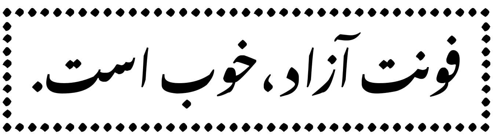

## فلسفه قلم‌تراش: توسعه فونت آزاد، هم به جامعه فونت آزاد کمک می‌کند و هم به جامعه فونت تجاری

فونت‌های آزاد، خیلی خوبند. هم به جامعه خودشان کمک می‌کنند و هم به جامعه غیرآزادها. البته بیشتر فونت‌های آزاد فارسی که تا الان طراحی شده‌اند، با ذهنیت برنامه‌نویس‌ها و توسعه‌دهندگان نرم افزار و وبسایت بیشتر همخوانی دارند تا ذهنیت طراحان گرافیک. «قلم‌تراش» سعی دارد فونت‌های آزاد فارسی را به نحوی توسعه دهد تا به ذهنیت طراحان گرافیک نیز نزدیک باشند و فونت‌ها در حدی باشند که یک طراح گرافیک، در طراحی‌های مختلف، بتواند از آنها استفاده کند.

**با توسعه فونت آزاد برای طراحان:**
 - طراح گرافیک نیازی به ملاحظات لایسنس ندارد
 - استاندارد طراحی فونت در سطح جامعه بالاتر می‌رود
 - استفاده نادرست از فونت تجاری کمتر می‌شود
